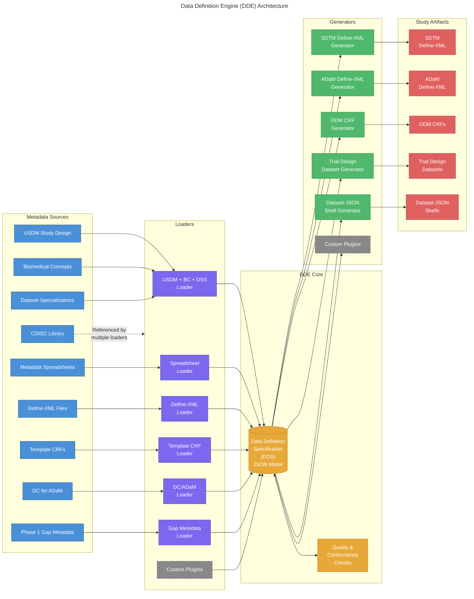

# Solution Overview

## Introduction
The Data Definition Engine (DDE) is a software tool being created by the Define-XML/CRF Generation sub-team of the 
CDISC 360i program. The DDE software populates the Data Definition Specification (DDS) model as JSON with the metadata 
needed to generate study artifacts, such as Define-XML, ODM CRFs, Dataset-JSON shells, and the Trial Design datasets. 

The DDE software will include multiple loaders and generators that use the DDS model. The loaders extract and load 
metadata content into the DDS model. The generators use the metadata in the DDS model to generate the study artifacts 
such as a define.xml or ODM-based CRFs. The following architecture diagram illustrates the overall flow from metadata 
sources through loaders into the DDS, and from the DDS through generators to produce study artifacts.

Loaders will include the primary 360i loader that reads the USDM study design content, gets the Biomedical Concepts 
referenced in the SOA, retrieves the Dataset Specializations (DSSs), and uses the CDISC Library API to populate the 
DDS model. An alternative loader will be created to load the DDS model from an Excel metadata spreadsheet template 
that matches the metadata spreadsheets used by many organizations today.

## Challenges
One of the most significant challenges to automating tasks like generating a define.xml or CRF file is aggregating 
all the metadata needed. This is a non-trivial challenge in most organizations. The DDS is designed to carry the 
complete set of metadata needed to generate these artifacts in addition to supporting other automation tasks. The 
DDS is the model at the center of the DDE solution. Loading the DDS will require a variety of metadata sources because:
1. There are gaps in the current metadata sources that necessitate pulling metadata from alternative sources to create a complete DDS
2. Different organizations maintain their metadata in different data storage systems and different formats, so the system must support a range of sources to be used by most organizations today
3. The DDS will source the metadata for many automation steps, requiring different metadata sources to satisfy different steps in the data pipeline.

The use of many new models in this process raises further challenges as they are unfamiliar to implementers and not yet 
mature. The DDS is drafted but not final. Using USDM + BCs + DSSs to generate study content represents the use of 
unfamiliar models in new workflows. Even more dramatic will be the use of the Derivation Concept (DC) models to generate 
the ADaM datasets.

Once complete, the DDS provides the metadata for a wide range of study processing scenarios. Therefore, in addition to 
the need for an extensible set of metadata loaders, the DDE will require a set of generators to create different 
outputs and to drive automation.

## Loaders
Pulling metadata from multiple sources is necessary to load sufficient metadata into the DDS as well as to work with 
the metadata sources available at a sponsor company, such as in cases where the sponsor has not yet implemented the 
USDM model. A set of metadata loaders will be part of the DDE solution. In 360i Phase 1 we created a loader that pulled 
metadata from the USDM + BCs + DSSs to support working directly from the digital study design. Next, we are adding a 
loader to pull metadata from metadata spreadsheets commonly used in the industry. Here is an initial set of loaders, 
not all have been started:
- USDM + BCs + DSSs
- Metadata spreadsheet
- Define-XML files
- DC for ADaM
- Template CRFs
- Phase 1 metadata gaps: addresses specific metadata elements identified during Phase 1 as unavailable from the primary sources (e.g., variable-level metadata not derivable from BCs or DSSs, missing computational methods, and other content required for complete artifact generation)
- CDISC Library (often part of other loaders)

The DDE will support the implementation of plugins so that sponsors can build loaders to pull metadata from other 
sources, such as MDRs or other metadata spreadsheets. A loader plugin must conform to the DDE's plugin interface, which 
defines the expected inputs, the DDS structures the loader is responsible for populating, and how the loader registers 
with the DDE. This plugin contract will be documented to enable sponsors and third-party developers to extend the DDE 
to work with their metadata sources.

## Generators
With a complete DDS prepared, we will provide a set of generators to create study outputs using the DDS metadata. 
For example, today there exists a define_generator.py application to generate Define-XML v2.1 from DDS content. 
Here is an expected set of generators:
- SDTM Define-XML
- ADaM Define-XML
- ODM CRFs
- Trial Design datasets
- Dataset-JSON shells

As with the loaders, we plan to create a plugin capability for generators to enable implementers to add generators 
needed to support their use cases. A generator plugin must conform to the DDE's generator plugin interface, which 
defines how the plugin accesses DDS content and the expected output format. This will be documented alongside the 
loader plugin contract.

## Incremental Loading
To generate a complete Define-XML or CRF for use as a specification, there exists no single source of metadata. 
This means that metadata will be pulled from multiple sources. The metadata gaps identified during Phase 1 are 
examples of metadata content not available from our primary sources, where the primary source would be something like 
USDM + BCs + DSSs. To address the metadata gaps, the solution will need to pull the missing metadata from another 
source and add it to the DDS. 

This presents some workflow and technical challenges since we are updating existing DDS metadata but may not want to 
overwrite the existing metadata. Furthermore, we need the context of the gap metadata to accurately insert it into the 
DDS. To support that, there will need to be a mechanism to highlight which bits of metadata are part of the update and 
which are providing context. 

### Metadata Provenance
When loading metadata from multiple sources incrementally, the DDS should track the origin of each metadata element. 
Recording which loader and source populated a given piece of metadata supports auditability, simplifies debugging 
when generated outputs contain unexpected content, and provides the foundation for conflict resolution when multiple 
sources supply values for the same metadata element.

## Incremental Generating
Incremental generation could allow new content to be added to an existing artifact. For example, if there's a change 
that triggers the need to update a define.xml, but that define.xml has been updated manually or by another system, then 
the ability to add the new changes to the older define.xml has utility. This could work similar to GitHub, where a diff 
is generated and if possible, the updates are merged into the existing version.

## Quality and Conformance
Once a DDS is populated, we will add checks to determine the state of the DDS content to support generating specific 
outputs. These checks will include:
- **Completeness checks**: verify that the metadata required by a specific generator is present in the DDS before generation is attempted. For example, a check could highlight that the metadata necessary to generate the SDTM Trial Design datasets is missing or incomplete.
- **Cross-reference consistency**: confirm that references between DDS elements are valid, such as ensuring that variables reference existing codelists and that dataset keys reference defined variables.
- **Output validation**: test generated outputs, such as a define.xml or ODM CRF, against their standard schemas.
- **Conformance rules**: apply specification-level conformance checks beyond schema validation, such as business rules defined in the Define-XML specification.

## References
- [DDE Repository](https://github.com/cdisc-org/data-definition-engine)
- [Template2Define Repository](https://github.com/swhume/template2define) (code being migrated to DDE repository)
