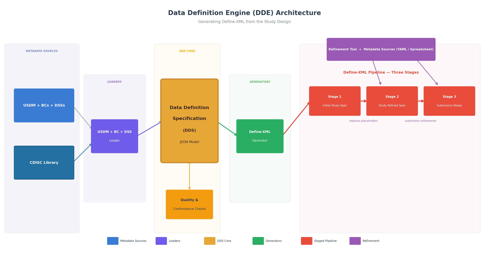

# Automating Define-XML Generation in the CDISC 360i Program

---

## Scope of the 360i Data Definition Engine Project
1. Define-XML generation
2. ODM-based CRF generation
3. Dataset Shell generation
4. Trial Design datasets generation
5. Generating SDTM datasets from Lab DTAs
6. Test a new draft model: Data Definition Specification (DDS)

This presentation focuses on SDTM Define-XML generation.

Speaker Notes:
While this presentation focuses on SDTM Define-XML generation, most of the principles covered here apply to our other 
deliverables. Instead of giving an overview of the 360i program or even an overview of our team's work, I will go into 
a bit more details on the SDTM Define-XML generation deliverable since we're further along on this one and it happens 
to be the feature that I've worked the most on.

---

## What Are We Trying to Accomplish?
1. Create a solution that maximizes automation and minimizes manually created metadata to generate Define-XML
2. Support generating Define-XML from the study design; this uses USDM -> Biomedical Concepts -> SDTM Dataset Specializations
3. Support using multiple sources of metadata to generate the Define-XML, such as existing metadata spreadsheets or MDRs
4. Create a new Data Definition Specification model to support metadata-driven automation
5. Identify and resolve metadata/standards gaps impeding automation

Speaker Notes:
This slide focuses on SDTM Define-XML generation, as noted previously. Our main focus is on creating a new way of 
automating Define-XML generation using USDM + BCs + DSSs. We'll use this same approach for ODM CRF generation,
but will use CRF Specializations instead of SDTM DSSs.

This is an innovative project. We're working towards making a leap forward, and to do this we've had to learn several 
new standards and models. So, this project has, at times, been an exploratory one where we have had to learn new
standards and models without any formal training. We're doing new things, and this calls for a pioneering spirit and
a willingness to deal with content and processes that are rough and incomplete.

Even supporting today's state-of-the-art metadata sources, such as existing metadata spreadsheets and MDRs requires
innovation because we are loading this content into the new DDS model.

Identifying gaps in the standards and pioneering new ways of working are what this project is all about.

---

## Why This Matters
1. Bridging future methods of generating Define-XML with current ways of working
2. Open-source where a team of experts performs ongoing development and maintenance
3. Higher quality Define-XMLs generated more efficiently
4. Realizing the benefits of your investment in standards via metadata-driven automation

Speaker Notes:
We are demonstrating new ways of generating study artifacts, like Define-XML, starting from the study design metadata.
We seek to use this method to maximize automation. This makes it easier to generate a Define-XML at the very beginning
of a study so that it can be used as a specification. It also makes it easier to re-generate the Define-XML 
specification when the study design is ammended.

---

## Inefficiencies in Today's Process
1. Manual and Inefficient Workflow
	- Current Define-XML workflows rely heavily on spreadsheets, local conventions, and manual editing, causing inefficiencies.
2. Error-Prone Processes
	- Manual copy-paste and ad hoc edits lead to mismatches and inconsistencies in metadata and datasets, increasing QC churn.
3. Limited Maintainability and Reuse
	- Spreadsheet templates are study-specific and not machine-interpretable, limiting standardization and systematic artifact generation.
4. Automation Opportunity
	- Generating Define-XML from a consistent metadata backbone reduces errors, streamlines updates, and scales across projects.

Speaker Notes:
I think most of us would agree that the current process is inefficient and error-prone. It's too manual. Define-XML
generation often occurs at the end of the study and is not available as a specification. With the availability of new 
standards and models, we believe we can increase the automation and quality of the Define-XML generation process. 
Every 1.32 studies go through protocol amendments. Our existing manual processes are not only error-prone, but 
unsustainable and expensive. Driving Define-XML generation automation from the study design should provide major quality
and efficiency benefits.

---

## The Project: The Data Definition Engine (DDE)

1. Metadata Sources
2. Loaders
3. The Data Definition Specification (DDS) model
4. Generators
5. Study Artifacts
6. A Refinement Pipeline

Speaker Notes:
This slide represents the key ideas I want to highlight in this presentation. It shows the Data Definition Engine
(DDE) architecture and highlights the components needed to achieve our goals.

TODO: Expand on each part of the architecture to understand the role each component plays in the process. 

---

## DDE: Generating Define-XML from the Study Design

1. Metadata Sources
   - USDM + BCs + DSSs
   - CDISC Library
2. Loaders
   - USDM + BCs + DSSs
3. DDS
   - JSON model
4. Generators
   - Define-XML
5. A Refinement Pipeline
   - Define-XML with PLACEHOLDERS
   - Study level refinement of Define-XML

Speaker Notes:
This slides focuses on one of our main 360i deliverables: generating Define-XML from a USDM-based study design. The
Define-XML generated can be used as an initial specification for the study. Since it's generated from the study design,
it can be be generated in the very beginning of the study. It can be updated as the study design is amended. These are
some process benefits that come along with the improvements in automation.

This approach retrieves the Biomedical Concepts from the USDM schedule of activities. It then uses the CDISC Library API
to look up the DSSs for each BC. Using this information, we are able to populate much of the Define-XML metadata,
including bits that are considered more challenging, like Value Level Metadata. However, there are quite a few gaps
in the metadata needed to full generate a conformant Define-XML. These tend to be basic, study-level content like 
KeySeuqence (which variables are keys), Length, whether a variable is mandatory or not, and so on. During the initial
Define-XML generation, we use placeholders for these metadata items. Then, in the refinement pipeline those placeholders
are with study-level metadata. The final step in that pipeline is performed at the end of the study to make any changes
or additions needed to make this submission-ready.

---

## Plug In Architecture
1. Add new loaders to address different sources of metadata, such as MDRs or other propreitary sources
2. Add new generators to create new study artifacts or variations of the supported artifacts
3. New approaches to the refinement pipeline

Speaker Notes:
The plug-in architecture allows implementers to add new loaders and generators to support new metadata sources and new
study artifacts. For example, if your organization uses an MDR with an API, a loader could be created to
extract metadata to load into the DDS. The generators work the same, regardless of how the content is loaded int the
DDS. Similarly, implementers can add new generators or extend the existing ones to create new study artifacts or to
add user-specific variations to existing ones. So, this adds flexibility to extend the DDE solution to support new
metadata sources and new study artifacts.

---

## Timeframes for the Solution Targets
1. Current State: current ways of generating Define-XML: e.g., metadata spreadsheets
2. New State: generating define.xml using USDM + BCs + DSSs
3. Future State: future standards like a new, JSON-based version of define, DTAs, etc.

Speaker Notes:
As noted previously, our main target is the New State: using USDM + BCs + DSSs to generate Define-XML and other study
artifacts. Given that most all sponsors have not yet adopted the new standards like USDM, and they have other sources of
study metadata that they currently use to generate their Define-XMLs. We would like to support as many common sources of
existing metadata as possible. 

For example, we would like to support commonly used metadata spreadsheets. This allows organizations to start using the
DDE right away, and they can move to the new standards when they are ready. As they are implementing major new changes, 
such as USDM, they will also likely continue to have the need to support their current processes until they've
completed the transition. It's also true that there are a lot of existing metadata spreadsheets, and loading this 
content helps us test the DDS model as well as the loaders.

---

## Metadata Gaps Identified
1. Numerous gaps in the metadata needed to automate Define-XML generation were identified
2. Examples include keySequence, Length, ...
3. To address the missing metadata, we used placeholders in the first Define-XML generated
4. Gaps may drive updates to standards

Speaker Notes:
Before beginning the project we understood that implementing end-to-end automation using new or existing standards
would identify gaps or misalignments in the available standards metadata. So, in this context, gaps and misalignments
aren't bugs, they're features. We expected to find gaps, and we've found and documented many of them.

TODO: add a better list of metadata gap examples.

---

## Data Definition Specification (DDS)
1. Role of Specification Model
	- The model links upstream conceptual models to downstream artifacts, replacing unreliable spreadsheet intermediaries.
	- The DDS is a new draft model that we will publish as a standard after we complete our 360i work.
2. Key Characteristics
	- Defines consistent metadata structure to support standards-driven generation and maintainability through metadata updates.
	- Targets automation in a way that Define-XML was not designed to support.
3. Alignment and Automation Benefits
	- Structured metadata enables automated validation, controlled terminology checks, and reliable value-level metadata building.
	- Provides the metadata to support many different automation tasks, beyond generating define.xml and ODM-based CRFs.
4. Extensibility and Feedback Loop
	- Designed for extensibility and interoperability, the model reveals standards gaps, fostering continuous improvement.
  
Speaker Notes:
The Data Definition Specification (DDS) is a new draft model that we will publish as a standard after we complete our 
360i work. We are using the DDS in our work as a new model is needed to address what we need to support end-to-end 
automation. Define-XML was never intended to drive end-to-end automation, though it has been used to do so at times.

For example, the DDS allows us to define both the data supply and demand, sometimes referred to as the source and 
target datasets. It allows us to define derivation methods in a more complete manner to support automation 
and not just provide documentation of the code used. It also does a better job of representing semantics and 
relationships. DDS and Define-XML were defined with different primary goals in mind.

In this presentation, I do not have time to get into the details of the DDS, but we are using it in our project and will 
be working towards publishing it as a standard, so there will be opportunities to learn more about it or even to get 
involved in its development.

---

## Future Work
1. Refine and enhance the current work-in-progress to create a usable solution
2. Add support for ADaM Define-XML
3. DTA to SDTM transformations
4. Plug In Architecture
5. Initial release targeted by EOY

Speaker Notes:
We are working towards refining and expanding the current work-in-progress to create a usable solution. To that end, we 
plan to publish a Release Candidate by the end of the year. This will be available as a release in GitHub. We aim for 
this to be a usable solution that's available to anyone to use without any licensing fees or restrictions. Similarly, 
this project is open to contributors, and we hope others will make contributions to the project so that it becomes a 
more robust solution for everyone, and there aren't just a few of us supporting it.

---

## Key Takeaways
1. Proof of Automation
	- Define-XML can be generated consistently from structured, standards-based metadata organized in a machine-consumable model.
2. Phased Progress Achieved
	- Phase 1 delivered automated SDTM Define-XML generation using new metadata specification models and biomedical concepts.
3. Forward Extension Plans
	- Phase 2 will automate ADaM Define-XML incorporating analysis concepts to represent analytical intent as structured metadata.
4. Process Improvement Benefits
	- Moving from spreadsheets to metadata-driven automation enhances reuse, maintainability, quality, and reduces errors.
5. Standards Feedback Loop
	- Automation efforts reveal gaps in CDISC standards, guiding standards evolution and better implementation.
6. Open-Source Adoption
	- Open-source solutions promote interoperability, accelerate learning, and reduce duplicated automation efforts across organizations.

Speaker Notes:

---

## Questions?
- Thank you!
- Where to Find Our Work: https://github.com/cdisc-org/data-definition-engine
- Join Us: https://www.cdisc.org/volunteer/form
- Contact