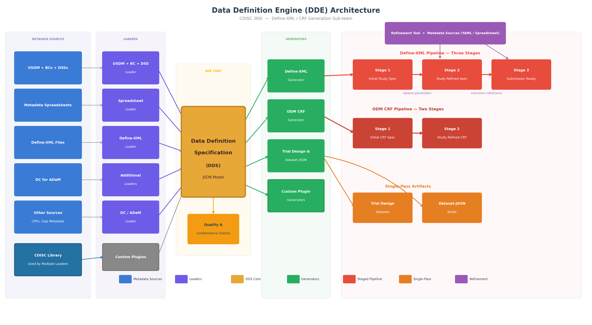

# Automating Define-XML Generation in the CDISC 360i Program

---

## Scope of the 360i Data Definition Engine Project
1. Define-XML generation
2. ODM-based CRF generation
3. Dataset Shell generation
4. Trial Design datasets generation
5. Generating SDTM datasets from DTAs

This presentation focuses on SDTM Define-XML generation, but most of the principles covered here apply to our other deliverables

---

## What Are We Trying to Accomplish
1. Create a solution that maximizes automation and minimizes manually created metadata to generate Define-XML
2. Support generating Define-XML from the study design; this uses USDM -> Biomedical Concepts -> SDTM Dataset Specializations
3. Support using multiple sources of metadata to generate the Define-XML, such as existing metadata spreadsheets
4. Create a new Data Definition Specification model to support metadata-driven automation
5. Identify and resolve metadata/standards gaps impeding automation

---

## Why This Matters
1. Bridging future methods of generating Define-XML with current ways of working
2. Open-source where ongoing development and maintenance is performed by a team of experts
3. Open-source means the application can be used without paying a license fee
4. Higher quality Define-XMLs generated more efficiently
5. Realizing the benefits of your investment in standards via metadata-driven automation

---

## Inefficiencies in Today's Process
1. Manual and Inefficient Workflow
	- Current Define-XML workflows rely heavily on spreadsheets, local conventions, and manual editing, causing inefficiencies.
2. Error-Prone Processes
	- Manual copy-paste and ad hoc edits lead to mismatches and inconsistencies in metadata and datasets, increasing QC churn.
3. Limited Maintainability and Reuse
	- Spreadsheet templates are study-specific and not machine-interpretable, limiting standardization and systematic artifact generation.
4. Automation Opportunity
	- Generating Define-XML from a consistent metadata backbone reduces errors, streamlines updates, and scales across projects.

---

## The Project: The Data Definition Engine (DDE)

1. Metadata Sources
2. Loaders
3. The Data Definition Specification model
4. Generators
5. Study Artifacts
6. A Refinement Pipeline

---

## Plug In Architecture
1. Add new loaders to address different sources of metadata, such as MDRs or other propreitary sources
2. Add new generators to create new study artifacts or variations of the supported artifacts
3. New approaches to the refinement pipeline

---

## Timeframes for the Solution Targets
1. Current State: current ways of generating Define-XML: e.g., metadata spreadsheets
2. New State: generating define.xml using USDM + BCs + DSSs
3. Future State: future standards like a new, JSON-based version of define, DTAs, etc.

---

## Metadata Gaps Identified
1. Numerous gaps in the metadata needed to automate Define-XML generation were identified
2. Examples include keySequence, Length, ...
3. To address the missing metadata, we used placeholders in the first Define-XML generated
4. Gaps may drive updates to standards

---

## Data Definition Specification (DDS)
1. Role of Specification Model
	- The model links upstream conceptual models to downstream artifacts, replacing unreliable spreadsheet intermediaries.
	- The DDS is a new draft model that we will publish as a standard after we complete our 360i work.
2. Key Characteristics
	- Defines consistent metadata structure to support standards-driven generation and maintainability through metadata updates.
	- Targets automation in a way that Define-XML was not designed to support.
3. Alignment and Automation Benefits
	- Structured metadata enables automated validation, controlled terminology checks, and reliable value-level metadata building.
	- Provides the metadata to support many different automation tasks, beyond generating define.xml and ODM-based CRFs.
4. Extensibility and Feedback Loop
	- Designed for extensibility and interoperability, the model reveals standards gaps, fostering continuous improvement.
  
---

## Future Work
1. Refine and enhance the current work-in-progress to create a usable solution
2. Add support for ADaM Define-XML
3. DTA to SDTM transformations
4. Plug In Architecture
5. Initial release targeted by EOY

---

## Key Takeaways
1. Proof of Automation
	- Define-XML can be generated consistently from structured, standards-based metadata organized in a machine-consumable model.
2. Phased Progress Achieved
	- Phase 1 delivered automated SDTM Define-XML generation using new metadata specification models and biomedical concepts.
3. Forward Extension Plans
	- Phase 2 will automate ADaM Define-XML incorporating analysis concepts to represent analytical intent as structured metadata.
4. Process Improvement Benefits
	- Moving from spreadsheets to metadata-driven automation enhances reuse, maintainability, quality, and reduces errors.
5. Standards Feedback Loop
	- Automation efforts reveal gaps in CDISC standards, guiding standards evolution and better implementation.
6. Open-Source Adoption
	- Open-source solutions promote interoperability, accelerate learning, and reduce duplicated automation efforts across organizations.
  
---

## Questions?
- Thank you!
- Where to Find Our Work: https://github.com/cdisc-org/data-definition-engine
- Join Us: https://www.cdisc.org/volunteer/form
- Contact